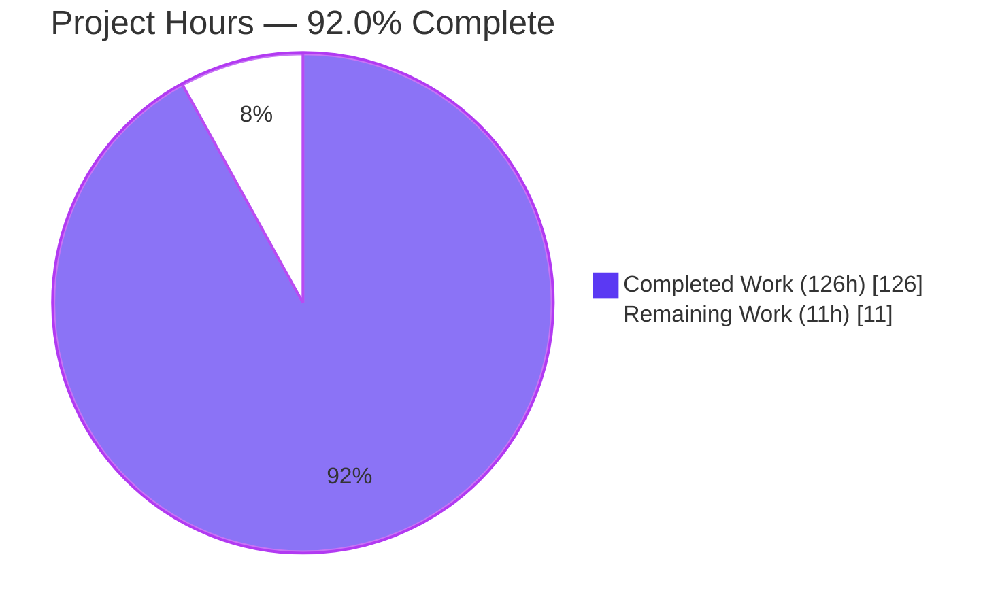
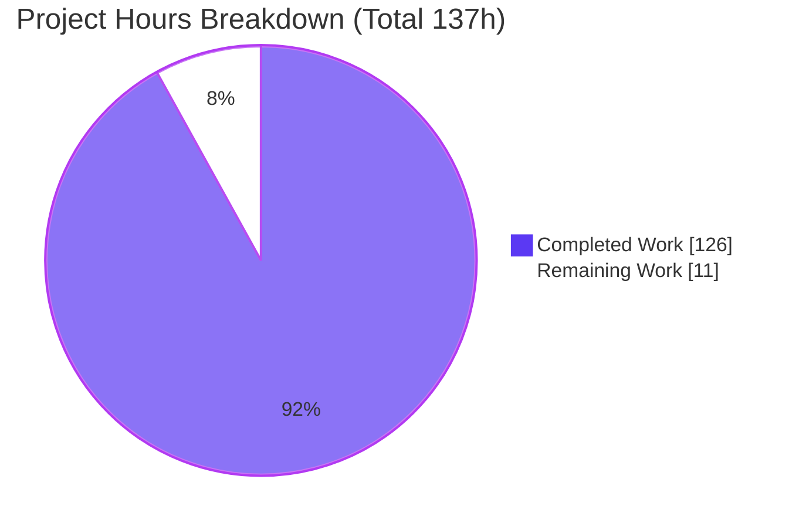
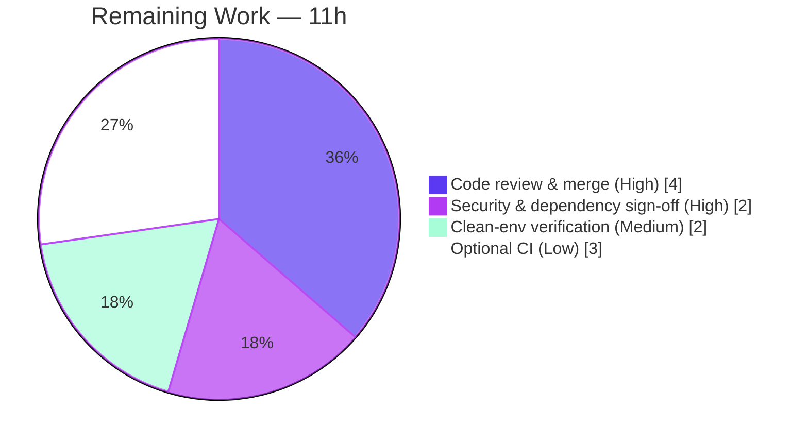

# Blitzy Project Guide — Project COBOL: COBOL → Java 21 / Spring Boot 3.x Migration

> **Brand legend:** **Completed / AI Work = Dark Blue (#5B39F3)** · Remaining / Not Completed = White (#FFFFFF) · Headings/Accents = Violet‑Black (#B23AF2) · Highlight = Mint (#A8FDD9)

---

## 1. Executive Summary

### 1.1 Project Overview

Project COBOL is a dual‑platform educational repository of COBOL sample programs. This effort migrates every translatable OpenCOBOL sample program into idiomatic **Java 21 / Spring Boot 3.x**, delivered as a Maven multi‑module project added **alongside** the untouched `OpenCobol/` COBOL sources and the `AS400/` branch. Target users are developers learning COBOL‑to‑Java translation patterns. The technical scope covers 11 topic sub‑modules, 26 entry classes (one per `.cbl`) using the `CommandLineRunner` pattern, a `FileStatus` enum, 26 JUnit 5 golden‑output tests, and the single permitted behavioral change: remediating a SQL‑injection vulnerability in the SQLite sample via JDBC `PreparedStatement`.

### 1.2 Completion Status



| Metric | Value |
|---|---|
| **Total Hours** | **137 h** |
| **Completed Hours (AI + Manual)** | **126 h** (126 h AI autonomous + 0 h manual) |
| **Remaining Hours** | **11 h** |
| **Percent Complete** | **92.0 %** |

> Completion is computed per the AAP‑scoped, hours‑based methodology: `Completed ÷ (Completed + Remaining) = 126 ÷ 137 = 91.97% → 92.0%`. 100 % of AAP engineering deliverables are complete and independently validated; the remaining 11 h is mandatory human governance plus optional path‑to‑production work that an autonomous agent cannot perform.

### 1.3 Key Accomplishments

- ✅ **Maven multi‑module build** — root parent POM (`packaging=pom`, `spring-boot-starter-parent:3.5.14`, `java.version=21`) aggregating all **11** topic sub‑modules; every child POM inherits the parent (11/11).
- ✅ **26 entry classes translated** — one Java `*Application` per translatable `.cbl`, each `@SpringBootApplication` + `implements CommandLineRunner`, in package `com.projectcobol.<submodule>`.
- ✅ **`FileStatus` enum** — 31 constants (30 COBOL `FILE-STATUS` codes + `UNKNOWN`) with a `fromCode(...)` factory, encapsulated inside `cobol-database`.
- ✅ **SQL‑injection security fix** — `cobol-sqlite` replaces the `ocsqlite` C binding with `org.xerial:sqlite-jdbc:3.53.1.0` and uses `PreparedStatement` parameter binding; verbatim SQLite functions (`randomblob`/`hex`/`lower`/`datetime`/`julianday`) preserved; neutralization verified at runtime.
- ✅ **Zero‑warning compile** — `mvn clean verify` builds all 12 modules with `-Xlint:all -Werror`, producing **0 warnings / 0 errors**.
- ✅ **JUnit 5 golden‑output testing** — 26 test classes / **28 tests**, 100 % pass, including a dedicated SQL‑injection regression test.
- ✅ **Documentation & licensing** — append‑only `README.md` Java section, new `OpenCobol/Games/README.md` documenting the raylib exclusion, and a GPLv3 header on all 53 Java files.
- ✅ **Out‑of‑scope integrity preserved** — zero modifications to `AS400/**`, `OpenCobol/**/*.cbl`, `data.txt`, or `LICENSE`.

### 1.4 Critical Unresolved Issues

| Issue | Impact | Owner | ETA |
|---|---|---|---|
| _None_ — no blocking issues identified | The build compiles clean, 28/28 tests pass, runtime and security fix verified | — | — |

> There are **no critical unresolved issues**. All remaining work is non‑blocking human governance / optional enhancement (see §1.6 and §2.2).

### 1.5 Access Issues

| System / Resource | Type of Access | Issue Description | Resolution Status | Owner |
|---|---|---|---|---|
| — | — | No access issues identified | N/A | — |

> **No access issues identified.** The build relies only on public Maven Central artifacts; no private registries, credentials, or third‑party API keys are required.

### 1.6 Recommended Next Steps

1. **[High]** Conduct human code review and approve the merge of the 53 Java sources + 12 POMs (translation fidelity, idiomatic Java, GPLv3 headers). — *HT‑1, 4 h*
2. **[High]** Perform security & dependency sign‑off: review the `PreparedStatement` remediation and run a license/CVE audit of `sqlite-jdbc 3.53.1.0` + `spring-boot 3.5.14`. — *HT‑2, 2 h*
3. **[Medium]** Verify the build on a clean environment (fresh clone, Java 21 + Maven 3.9+): `mvn clean package` then `mvn test` (expect 28/28). — *HT‑3, 1.5 h*
4. **[Medium]** Add `test.db` to `.gitignore` so the file‑backed SQLite sample cannot pollute the working tree. — *HT‑4, 0.5 h*
5. **[Low]** *(Optional, beyond AAP scope)* Add a CI workflow running `mvn -B clean verify` on push/PR to keep the build green and enable automated dependency scanning. — *HT‑5, 3 h*

---

## 2. Project Hours Breakdown

### 2.1 Completed Work Detail

All rows below are AAP‑scoped engineering delivered autonomously and independently validated.

| Component | Hours | Description |
|---|---:|---|
| Maven multi‑module build infrastructure | 8 | Root parent POM + 11 child POMs; `-Xlint:all -Werror` compiler policy; `spring-boot-maven-plugin` fat‑jar repackage; `mainClass`/`loader.main` config for multi‑entry modules; `.gitignore` extension |
| `cobol-helloworld` | 1 | `HelloWorldApplication` — `DISPLAY` → `System.out.println` |
| `cobol-conditions` (8 classes) | 12 | Class/Combined/ConditionName/ConditionStatement/EvaluteVerb/Negated/Relation/Sign — predicate & `EVALUATE`→`switch` translations |
| `cobol-database` (4 classes + `FileStatus` + `data.txt`) | 16 | `BufferedReader` file I/O, fixed‑width `substring` extraction, `FileStatus` enum (31 consts), classpath `data.txt` resource |
| `cobol-date` | 2 | `ACCEPT FROM DATE/TIME` → `LocalDate`/`LocalTime` |
| `cobol-loops` (2 classes) | 3 | `PERFORM UNTIL`→`while`, `PERFORM VARYING`→`for` |
| `cobol-memory` (2 classes) | 8 | `POINTER`/`LINKAGE SECTION` modeled as `String.substring` views over a backing buffer + explanatory inline docs |
| `cobol-random` (2 classes) | 4 | `FUNCTION RANDOM` → `java.util.Random`, `SECONDS-PAST-MIDNIGHT` seeding |
| `cobol-sqlite` (security fix) | 14 | `ocsqlite`→JDBC, callback→`ResultSet`, `PreparedStatement` parameter binding, verbatim SQL preservation |
| `cobol-sort` (3 classes) | 8 | Bubble / insertion / selection sort on `int[]` |
| `cobol-string` | 2 | Reference‑modification `substring` iteration |
| `cobol-struct` | 3 | `78‑level` constants, grouped `OCCURS` arrays |
| JUnit 5 golden‑output test suite | 33 | 26 test classes + 26 `expected/*.txt` fixtures; determinism strategies (regex / format‑match / seed‑injection / `:memory:`); SQL‑injection regression |
| Documentation | 4 | Append‑only `README.md` Java section; `OpenCobol/Games/README.md`; GPLv3 headers; inline COBOL→Java mapping comments |
| QA validation & build hardening | 8 | Banner/log suppression (19 classes), LF/CRLF golden‑output stability, fat‑jar `mainClass` pinning, multi‑checkpoint review cycles |
| **TOTAL COMPLETED** | **126** | |

### 2.2 Remaining Work Detail

Each category is human governance or optional path‑to‑production — **none** is an AAP engineering gap.

| Category | Hours | Priority |
|---|---:|---|
| Human code review & merge approval (53 Java + 12 POMs) | 4 | High |
| Security & dependency sign‑off (review SQLi fix; license/CVE audit of `sqlite-jdbc` + `spring-boot`) | 2 | High |
| Clean‑environment build & run verification (+ `.gitignore` `test.db` hardening) | 2 | Medium |
| Optional CI workflow (build‑green enforcement + automated dependency scanning) — beyond AAP scope | 3 | Low |
| **TOTAL REMAINING** | **11** | |

### 2.3 Hours Calculation Summary

| Quantity | Value |
|---|---:|
| Completed Hours (Σ §2.1) | 126 |
| Remaining Hours (Σ §2.2) | 11 |
| **Total Project Hours** | **137** |
| **Completion %** = 126 ÷ 137 | **91.97 % → 92.0 %** |

> Integrity: §2.1 (126) + §2.2 (11) = 137 = Total in §1.2 ✓ · §2.2 (11) = §1.2 Remaining (11) = §7 "Remaining Work" (11) ✓

---

## 3. Test Results

All tests below originate from Blitzy's autonomous validation logs and were **independently re‑executed** for this report via `mvn -B clean verify` (parsed from 26 surefire `TEST-*.xml` reports).

| Test Category | Framework | Total Tests | Passed | Failed | Coverage | Notes |
|---|---|---:|---:|---:|---|---|
| Unit — Golden Output | JUnit Jupiter 5.12.2 | 27 | 27 | 0 | 100 % of entry classes | Captures `System.out` and compares to `expected/*.txt`; covers all 26 entry classes |
| Security Regression | JUnit Jupiter 5.12.2 | 1 | 1 | 0 | SQLi path | `injectionAttemptIsNeutralized` — `PreparedStatement` neutralizes `'; DROP TABLE trial; --` |
| **TOTAL** | | **28** | **28** | **0** | **100 % pass** | 26 suites; 0 errors; 0 skipped |

**Per‑module breakdown (suites / tests):** helloworld 1/1 · conditions 8/8 · database 4/4 · date 1/1 · loops 2/2 · memory 2/2 · random 2/2 · sort 3/3 · **sqlite 1/2** (golden + injection) · string 1/1 · **struct 1/2**.

- **Determinism handling:** date → regex timestamp match; memory → pointer‑address format match; random & sort → seed‑injected `java.util.Random`; sqlite → `jdbc:sqlite::memory:`. Re‑run multiple times with identical results (stable, not flaky).
- **Coverage note:** No line‑coverage tool (e.g., JaCoCo) was configured by the AAP; coverage is **behavioral** — every one of the 26 entry classes has ≥ 1 golden‑output test (100 % of entry classes).

---

## 4. Runtime Validation & UI Verification

**Runtime health** (all 11 fat‑jars built by `mvn clean package`; entry classes executed):

- ✅ **Operational** — `cobol-helloworld` → `Hello world!` (exit 0)
- ✅ **Operational** — Multi‑entry modules via `-Dloader.main` — e.g., `conditions/EvaluteVerbApplication` → `NUMBER01 GREATER THAN 2`; `sort/InsertSortApplication` → ascending output (exit 0)
- ✅ **Operational** — `cobol-database` reads `data.txt` from the classpath and extracts fixed‑width fields (exit 0)
- ✅ **Operational** — `cobol-sqlite` end‑to‑end: schema create → insert (verbatim `randomblob`/`hex`/`lower`/`datetime`/`julianday`) → parameterized select → row display (exit 0)
- ✅ **Operational (Security)** — SQL‑injection payload `'; DROP TABLE trial; --` supplied as input → **no crash, `trial` table NOT dropped** (verified via `sqlite_master`); runtime security fix confirmed

**API integration:** ✅ `sqlite-jdbc 3.53.1.0` JDBC driver loads its bundled native library and connects via `java.sql.DriverManager` — no external service required.

**UI verification:** ⚠ **Not applicable.** The programs are console applications (`DISPLAY`/`ACCEPT` → `System.out`/`Scanner`); there is no GUI/web layer. The only graphical COBOL sources (`OpenCobol/Games/raylib/*.cbl`) are intentionally excluded from translation and documented in `OpenCobol/Games/README.md`.

---

## 5. Compliance & Quality Review

AAP deliverables cross‑mapped to quality/compliance benchmarks. All fixes were applied during autonomous validation; no outstanding compliance items remain.

| Benchmark (AAP acceptance criterion) | Status | Progress | Evidence |
|---|---|---|---|
| Untouched `AS400/**`, `OpenCobol/**/*.cbl`, `data.txt`, `LICENSE` | ✅ Pass | 100 % | `git diff` = 0 changes to all four |
| `README.md` updated append‑only | ✅ Pass | 100 % | 80 insertions / 0 deletions; Java section at line 57+ |
| Java output matches COBOL behavior | ✅ Pass | 100 % | 28/28 golden‑output tests pass |
| SQL‑injection fix is the only behavioral change | ✅ Pass | 100 % | `PreparedStatement` binding; runtime payload neutralized |
| GPLv3 header on every `.java` | ✅ Pass | 53/53 | `grep` matches all Java files |
| Zero‑warning Java 21 compile (`-Xlint:all -Werror`) | ✅ Pass | 0 warnings | `mvn clean verify` BUILD SUCCESS, 0 `[WARNING]` |
| Maven multi‑module, per‑topic sub‑modules | ✅ Pass | 11/11 | parent + 11 children all build |
| Package `com.projectcobol.<submodule>` | ✅ Pass | 100 % | directory ↔ package alignment |
| `@SpringBootApplication` + `CommandLineRunner` | ✅ Pass | 26/26 | annotation + interface on every entry class |
| One `.cbl` → one Java class | ✅ Pass | 26/26 | 26 translatable `.cbl` ↔ 26 entry classes |
| JUnit 5 golden‑output, fixtures at `expected/<Class>.txt` | ✅ Pass | 26/26 | fixtures present; tests load & assert |
| Filename traceability (incl. preserved `EvaluteVerb` spelling, `DateAndTime`) | ✅ Pass | 100 % | class names follow source filenames |
| Dependency licensing GPLv3‑compatible | ✅ Pass | 100 % | Apache‑2.0 / EPL‑2.0 / MIT — all compatible |

---

## 6. Risk Assessment

Overall posture: **LOW.** The one historically‑High risk (SQL injection) is **resolved** and runtime‑verified. Open items are minor and/or by‑design.

| Risk | Category | Severity | Probability | Mitigation | Status |
|---|---|---|---|---|---|
| Non‑deterministic tests use regex/format/seed assertions | Technical | Low | Low | Seeds fixed; strategy documented (AAP §0.6.1); could tighten asserts | Mitigated |
| Multi‑entry modules need `-Dloader.main` for non‑default class | Technical | Low | Low | README documents the pattern | Mitigated |
| Spring Boot overhead for trivial console programs (11–23 MB jars) | Technical | Low | — | AAP‑mandated `CommandLineRunner` pattern | Accepted |
| SQL injection in SQLite sample | Security | High → Resolved | — | `PreparedStatement` parameter binding; runtime‑verified | **Resolved** |
| Dependency CVE exposure over time (no automated scanning) | Security | Low‑Med | Med (over time) | Human dependency audit (HT‑2); optional Dependabot (HT‑5) | Open (by design) |
| Original `Hello_SQLITE.cbl` remains vulnerable (intentional) | Security | Low | — | Educational‑only, never deployed; AAP forbids editing COBOL source | Accepted |
| No CI/CD — build‑green not enforced on future commits | Operational | Low | Med | Optional CI workflow (HT‑5) | Open (by design; AAP §0.2.2) |
| `cobol-sqlite` file‑backed mode writes `test.db` to CWD | Operational | Low | Med | Run from scratch dir (README); add `test.db` to `.gitignore` (HT‑4) | Open (minor) |
| Monitoring / health‑checks absent | Operational | — | — | N/A — short‑lived console batch programs | Not applicable |
| Maven Central reachability for first build | Integration | Low | Low | Public artifacts; prereqs documented; cached in `~/.m2` | Mitigated |
| `sqlite-jdbc` native lib on exotic arch/OS | Integration | Low | Low | Bundles Win/macOS/Linux/FreeBSD natives | Mitigated |
| Toolchain requires Java 21 + Maven 3.9+ | Integration | Low | Low | Prereqs documented; `-release 21` enforced | Mitigated |

---

## 7. Visual Project Status



**Remaining hours by category (§2.2):**



> Integrity: §7 "Remaining Work" (11) = §1.2 Remaining (11) = Σ §2.2 (11) ✓ · §7 "Completed Work" (126) = §1.2 Completed (126) = Σ §2.1 (126) ✓

---

## 8. Summary & Recommendations

**Achievements.** The COBOL → Java 21 / Spring Boot 3.x migration is **functionally complete and independently validated**. All 26 translatable OpenCOBOL programs are reproduced as idiomatic Java entry classes across 11 Maven sub‑modules; the SQLite sample's SQL‑injection vulnerability is remediated with `PreparedStatement` binding (the single permitted behavioral change); the project compiles zero‑warning under Java 21 (`-Werror`), and all **28** JUnit 5 tests pass. Out‑of‑scope integrity (the `OpenCobol/` COBOL originals, the `AS400/` branch, and `LICENSE`) is perfectly preserved.

**Remaining gaps.** No engineering gaps remain. The outstanding **11 h** is mandatory human governance — code review, security/dependency sign‑off, clean‑environment verification — plus one optional, beyond‑AAP CI enhancement.

**Critical path to production.** Human code review (HT‑1) → security & dependency sign‑off (HT‑2) → clean‑environment verification (HT‑3) → merge. The `.gitignore` `test.db` hardening (HT‑4) and optional CI (HT‑5) can follow the merge.

**Production readiness.** **The project is 92.0 % complete.** It is ready for human review and merge. The remaining 8 % reflects governance activities an autonomous agent cannot perform (per Blitzy policy, autonomous completion never exceeds 99 % before human sign‑off).

| Success Metric | Target | Actual |
|---|---|---|
| AAP entry classes delivered | 26 | 26 ✅ |
| Compile warnings (`-Xlint:all -Werror`) | 0 | 0 ✅ |
| Test pass rate | 100 % | 100 % (28/28) ✅ |
| SQL‑injection neutralized | Yes | Yes ✅ |
| Out‑of‑scope files changed | 0 | 0 ✅ |

---

## 9. Development Guide

### 9.1 System Prerequisites

- **Java 21 JDK** (e.g., Eclipse Temurin 21) — verified with OpenJDK 21.0.11
- **Apache Maven 3.9+** — verified with Maven 3.9.9
- ~300 MB free disk (dependencies + build artifacts); network access to Maven Central for the first build
- OS: Linux / macOS / Windows (no platform‑specific steps; `sqlite-jdbc` bundles native libraries)

### 9.2 Environment Setup

```bash
# Verify the toolchain
java -version     # expect: openjdk version "21..."
mvn -version      # expect: Apache Maven 3.9.x

# Clone the repository
git clone https://github.com/Martinfx/Cobol.git && cd Cobol
```

No environment variables are required. There are no databases, caches, or message queues to provision — `cobol-sqlite` uses an embedded SQLite database file created on demand.

### 9.3 Dependency Installation & Build

```bash
# Build all 11 sub-modules (skip tests for a fast artifact build)
mvn clean package -DskipTests
# -> produces cobol-<topic>/target/cobol-<topic>-1.0.0.jar for every module

# Build a single module (with its reactor dependencies)
mvn -pl cobol-helloworld -am clean package
```

Maven resolves all dependencies from Maven Central on first run and caches them in `~/.m2`. Expected final line: `BUILD SUCCESS`.

### 9.4 Application Startup (Run)

```bash
# Run a single-entry module
java -jar cobol-helloworld/target/cobol-helloworld-1.0.0.jar
# -> Hello world!

# Multi-entry modules (conditions, database, loops, memory, random, sort):
# Default entry class runs when no option is given:
java -jar cobol-sort/target/cobol-sort-1.0.0.jar            # BubbleSortApplication

# Select any other entry class with -Dloader.main=<FQCN>:
java -Dloader.main=com.projectcobol.sort.InsertSortApplication -jar cobol-sort/target/cobol-sort-1.0.0.jar
java -Dloader.main=com.projectcobol.conditions.EvaluteVerbApplication -jar cobol-conditions/target/cobol-conditions-1.0.0.jar
```

> **`cobol-sqlite` note:** the production path uses `jdbc:sqlite:test.db`, which creates `test.db` in the **current working directory**. Run it from a scratch directory to avoid creating an untracked file in the repository.

### 9.5 Verification

```bash
# Run the full test suite (28 tests across 11 modules)
mvn test
# -> Tests run: 28, Failures: 0, Errors: 0, Skipped: 0  ;  BUILD SUCCESS

# Run a single module's tests (cobol-sqlite includes the injection regression)
mvn -pl cobol-sqlite -am test
# -> Tests run: 2, Failures: 0, Errors: 0, Skipped: 0

# Authoritative full build (compile + tests + package, zero-warning enforced)
mvn clean verify
# -> BUILD SUCCESS, 12 modules, 0 [WARNING], 0 [ERROR]
```

### 9.6 Example Usage

```bash
# Security demonstration: the SQL-injection payload is neutralized, not executed
cd "$(mktemp -d)"
printf "'; DROP TABLE trial; --\n" | java -jar /path/to/Cobol/cobol-sqlite/target/cobol-sqlite-1.0.0.jar
# -> program runs, displays rows, and the 'trial' table is NOT dropped
```

### 9.7 Troubleshooting

| Symptom | Cause | Resolution |
|---|---|---|
| `release version 21 not supported` | JDK < 21 active | Install Java 21; set `JAVA_HOME` to the Java 21 JDK |
| Multi‑entry jar runs the wrong class | Default entry class selected | Pass `-Dloader.main=<fully.qualified.ClassName>` |
| `test.db` appears in your repo | `cobol-sqlite` file‑backed mode writes to CWD | Run from a scratch dir; (optional) add `test.db` to `.gitignore` |
| First build fails resolving dependencies | Maven Central unreachable | Check network/proxy or `~/.m2/settings.xml`; deps then cache locally |
| Build breaks on a compiler warning | `-Werror` escalates warnings | Fix the warning — the zero‑warning policy is intentional, do not relax the flag |

---

## 10. Appendices

### A. Command Reference

| Command | Purpose |
|---|---|
| `mvn clean package -DskipTests` | Build all 11 fat‑jars without running tests |
| `mvn -pl <module> -am clean package` | Build one module + its reactor dependencies |
| `mvn test` | Run all 28 JUnit 5 tests |
| `mvn -pl <module> -am test` | Run one module's tests |
| `mvn clean verify` | Full zero‑warning build + tests + package |
| `java -jar <module>/target/<module>-1.0.0.jar` | Run a module's default entry class |
| `java -Dloader.main=<FQCN> -jar <jar>` | Run a specific entry class in a multi‑entry module |

### B. Port Reference

| Port | Service |
|---|---|
| — | None. All programs are console batch applications with no network listeners. |

### C. Key File Locations

| Path | Purpose |
|---|---|
| `pom.xml` | Root parent POM (modules, Java 21, `-Xlint:all -Werror`, plugins) |
| `cobol-<topic>/pom.xml` | Sub‑module POM (inherits `cobol-parent`) |
| `cobol-<topic>/src/main/java/com/projectcobol/<topic>/*Application.java` | Entry classes |
| `cobol-database/src/main/java/com/projectcobol/database/FileStatus.java` | COBOL `FILE-STATUS` enum (31 constants) |
| `cobol-database/src/main/resources/data.txt` | Classpath fixture for database samples |
| `cobol-<topic>/src/test/java/.../*ApplicationTest.java` | Golden‑output tests |
| `cobol-<topic>/src/test/resources/expected/*.txt` | Golden‑output fixtures |
| `OpenCobol/**/*.cbl` | Original COBOL sources (untouched references) |
| `OpenCobol/Games/README.md` | raylib exclusion rationale |

### D. Technology Versions

| Component | Version |
|---|---|
| Java (LTS) | 21 (built/tested on 21.0.11) |
| Apache Maven | 3.9+ (tested 3.9.9) |
| Spring Boot | 3.5.14 |
| `org.xerial:sqlite-jdbc` | 3.53.1.0 |
| JUnit Jupiter | 5.12.2 |

### E. Environment Variable Reference

| Variable | Required | Notes |
|---|---|---|
| `JAVA_HOME` | Recommended | Point to the Java 21 JDK |
| — | — | No application‑specific environment variables are required |

### F. Developer Tools Guide

- **Build/test:** Apache Maven (reactor build across 12 modules).
- **Packaging:** `spring-boot-maven-plugin` (repackage → executable fat‑jars); `PropertiesLauncher` enables `-Dloader.main` entry‑class selection.
- **Quality gate:** `maven-compiler-plugin` with `-Xlint:all -Werror -release 21` — the project's lint/quality gate is the zero‑warning compile.
- **Testing:** JUnit Jupiter 5 (golden‑output capture of `System.out` vs `expected/*.txt`); `spring-boot-starter-test` provides the test scaffolding.

### G. Glossary

| Term | Definition |
|---|---|
| **Golden‑output test** | A test that captures `System.out` and asserts it equals (or matches) a pre‑recorded `expected/*.txt` fixture. |
| **`CommandLineRunner`** | Spring Boot interface whose `run(String...)` executes after context startup — the idiomatic equivalent of COBOL's `PROCEDURE DIVISION`/`MAIN-PROCEDURE`/`GOBACK`. |
| **`PreparedStatement`** | JDBC API that binds parameters separately from SQL text, structurally preventing SQL injection. |
| **`FileStatus` enum** | Java translation of the COBOL `FILE-STATUS` 88‑level condition table (30 codes + `UNKNOWN`). |
| **`-Dloader.main`** | Spring Boot `PropertiesLauncher` property selecting which entry class a multi‑entry fat‑jar runs. |
| **raylib** | C graphics library used by two excluded `Games/` COBOL samples; no idiomatic Java equivalent, hence not translated. |